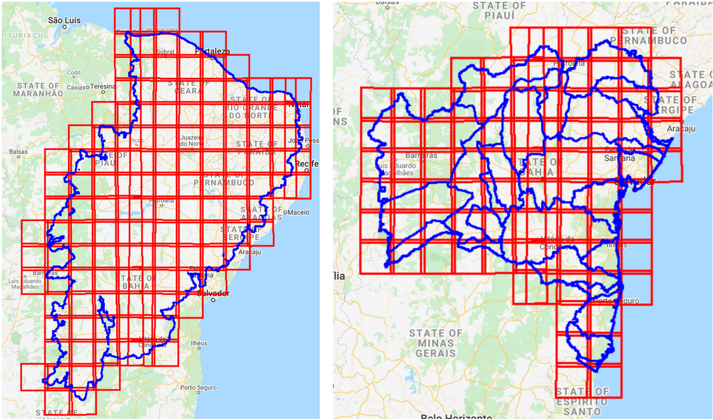
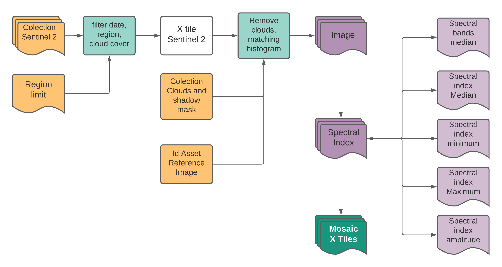

## Methodology for building normalized Sentinel 2 mosaics

This project aims to develop a methodology for the creation of analytical images for each tile of the Sentinel 2 sensor, in the regions of Caatinga biome and the state of Bahia. Each analytical image will represent one whole year, and it will serve as base mosaic for 3 consecutive projects, in the areas of agriculture, mining and use and coverage mapping.

The first step was to create a script to obtain grids of interest within the study regions, from a Sentinel 2 tile grid shapefile (figure 1) and to make a list with the name of each tile to be processed later.

scripts: “get_lista_Tile_x_Regions.js”
the scripts must be run on the Google Earth Engine platform.

Figure #1: Grids and study regions

    

Figure #2: Process flow chart

    

